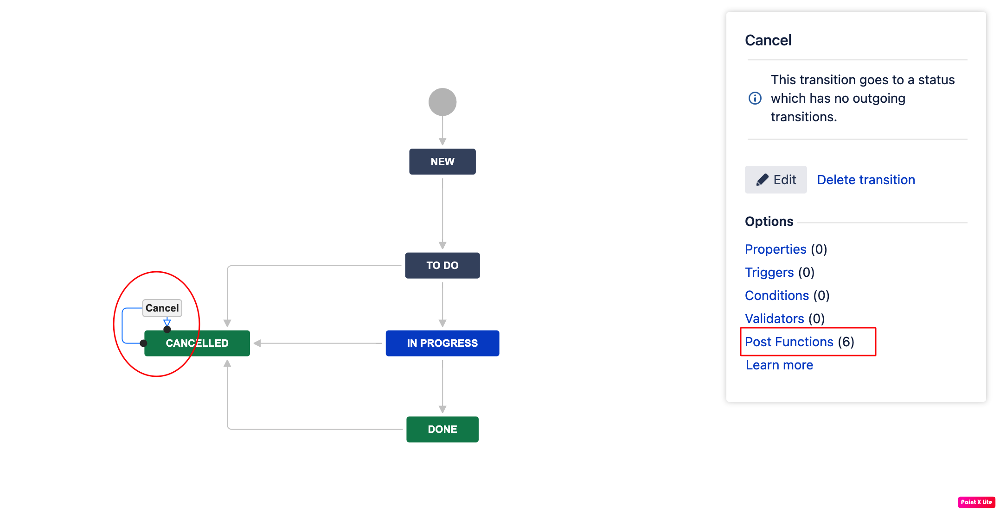
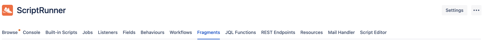
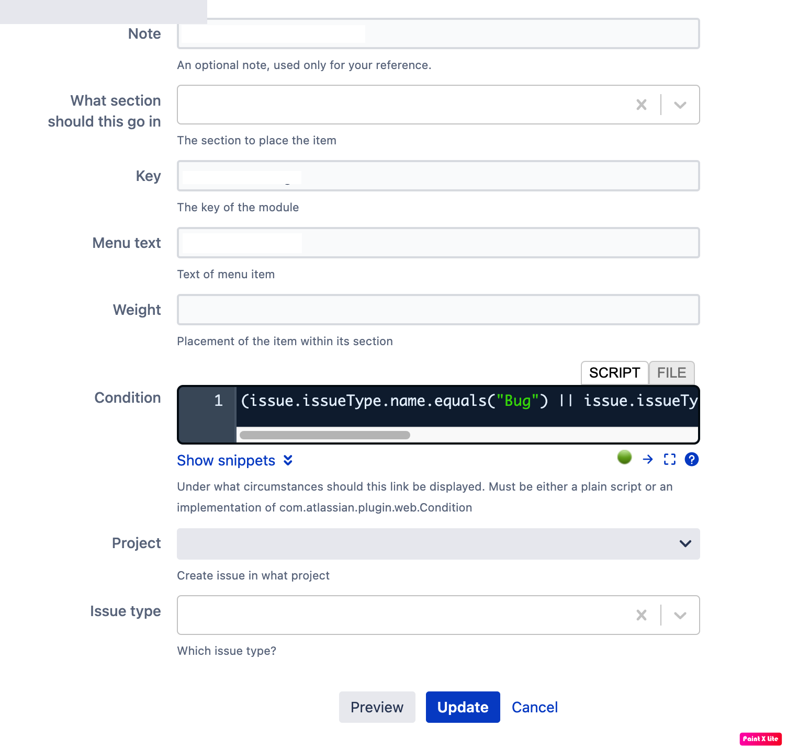
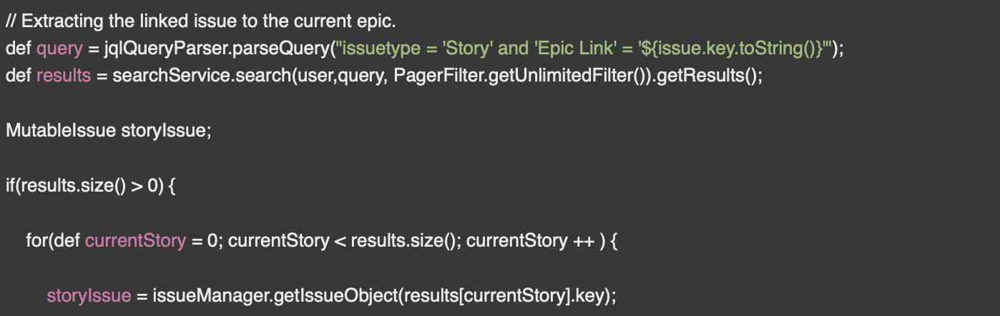

# This Repository is holding a bunch of Jira Server (On-premise) scripts for Script listeners, Behaviors and Workflow scripts & Validators.

##### Beginners & Advanced.

##### API Version 7.6.1.

### <a href="https://support.atlassian.com/jira-cloud-administration/docs/configure-advanced-issue-workflows/"> Jira Advanced Workflow Configuration </a>

---

#### Workflow Script =>

- Create a new Workflow.
- Create a new Transition.
- Click on Post Functions.
- Create you wanted type of script.

##### <b> Always remember to publish you WF changes.</b>



---

# Behaviors

#### I like to use a Fragments to set up configurations like displaying something on the screen or removing some elements from the screen.



#### In this example, We Adding some elements to the screen.

##### Configure you fragment.



---

# Acvanced Scripts

#### Say you want to find a specific issue, or a bunch of them.

#### A jql searcher lets you do it super easy !




-----

# API Calls

### <a href="https://developer.atlassian.com/server/jira/platform/rest-apis/" target="_blank"> Jira REST API Documentation. </a>

#### I have written a Nodejs server to integrate Jira Server. <a href="https://github.com/Shachar297/Jira/tree/Jira-Server-Intergration"> You can find it here. </a>

### Create Issue JSON Exmple

```sh
{
    "fields": {
        "project": {
            "id": 10000
        },
        "summary": "My summary",
        "issuetype": {
            "name": "Story"
        },
        "assignee": {
            "name": "${config.system.name}"
        },
      "customfield_10108": "FJP-2"
    }
}
```

### Create Filter JSON Exmple

```sh  
{
    "name": "All Empty Stories",
    "description": "Lists all stand alone Stories",
    "jql": "type = Story and 'Epic Link' is empty",
    "favourite": true
}
```

```js
try {
    filter = await axios.post(`${config.system.baseUrl}filter/`, {body : filterFields}, header)
    .then((res) => {
        return filter
    });
} catch (error) {
    throw new ServerError(error);
}
```
